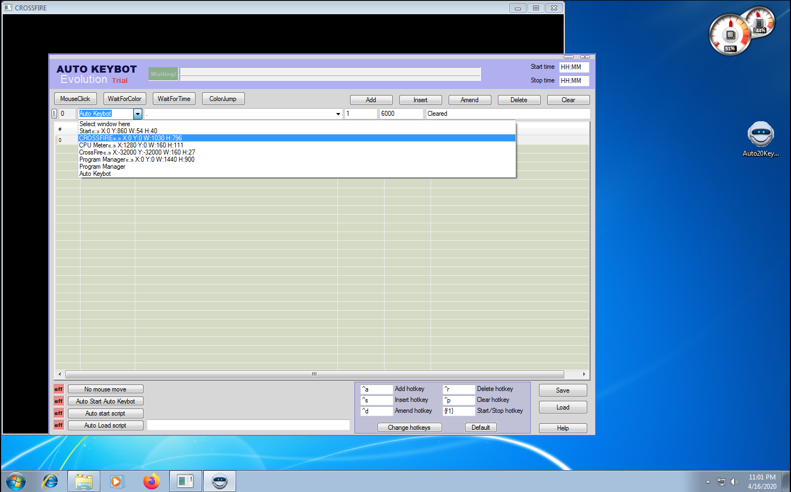
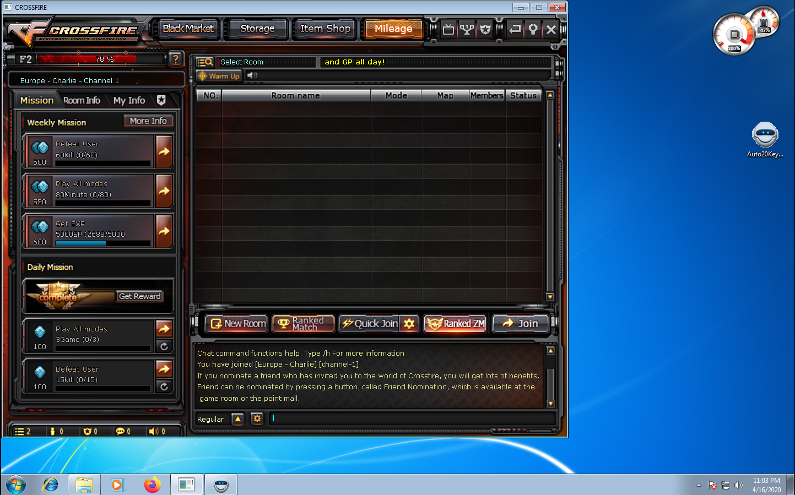
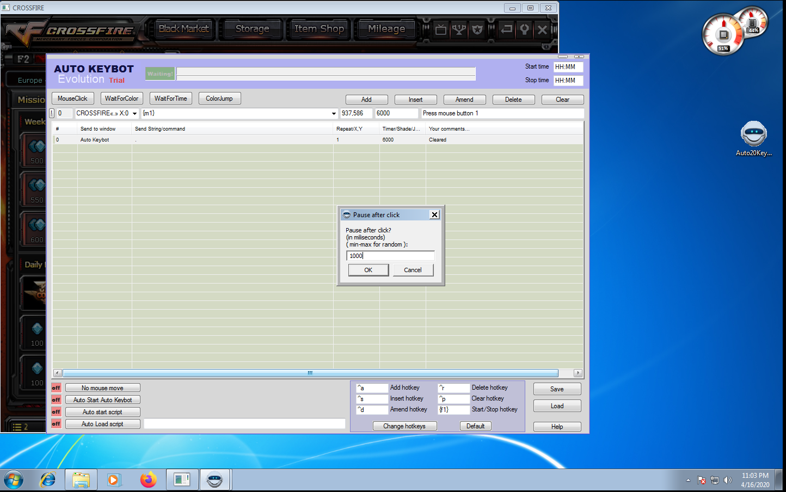
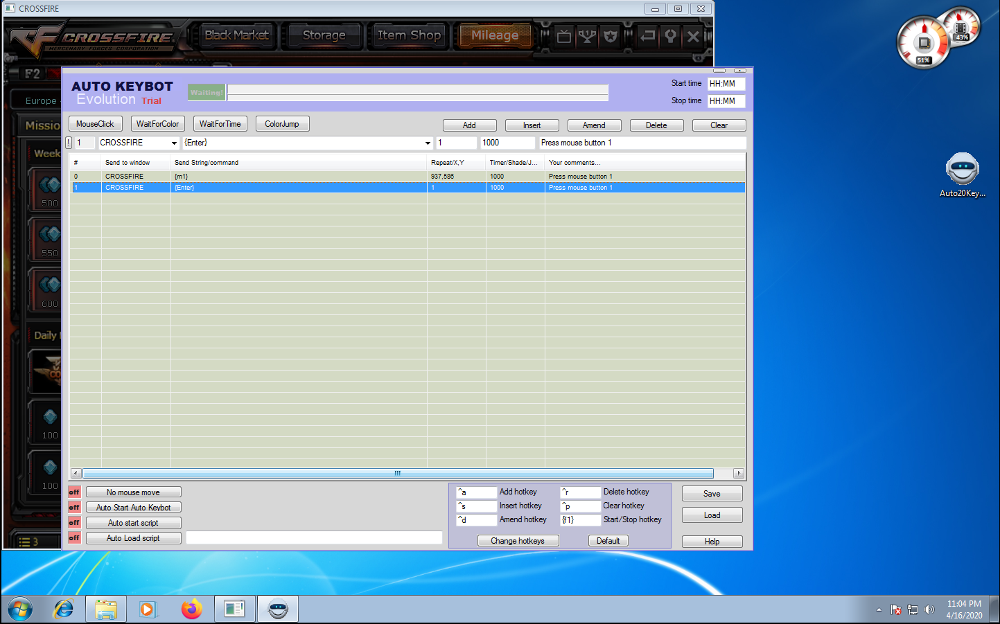

# Virtual Machine AFK-Bot & Auto-Ready Setup Instructions

> This guide will show you how to set up auto read & afk bot inside your Virtual Machine.

!!! tip
    This is mainly used for EXP/Badge farming.  
    It prevents the bots from idling and ensures they're pressing ready after every match.

## Requirements

- [Auto Keyboard Evolution Auto Clicker](http://www.tucows.com/preview/1583989/Autoclicker-Auto-Keybot-Evolution) on your Virtual Machine
- CrossFire started in Window Mode

## Setup Instructions (Text)

!!! info
    You must start the auto clicker as Administrator

Launch the Auto Keyboard Evolution.  
Select `Clear List` to get rid of the default entries.  

!!! info
    One item will remain by default. You can simply remove the item once you've added your own configuration.  

From the dropdown Application List select `CROSSFIRE`.  
Now click on `Mouse Click`, the window will minimize.  
Wait until CF has resumed from its black screen.  

Click on the `Join` button inside CrossFire and wait until the Auto Keyboard Program opens up again.  
Enter a timeout of your choice. The recommended value is `1000` (1 sec).

Now add a second entry, replace `{M1}` with `{Enter}` and change the coordinates to `1`.  
Below you can find a sample configuration of how it can look like.

Once you're done configuring you can start the bot by pressing `F1`.  
That's it. Your cow should be good to go.  

## Setup Instructions (Video)

> TODO: Video is coming soon...
