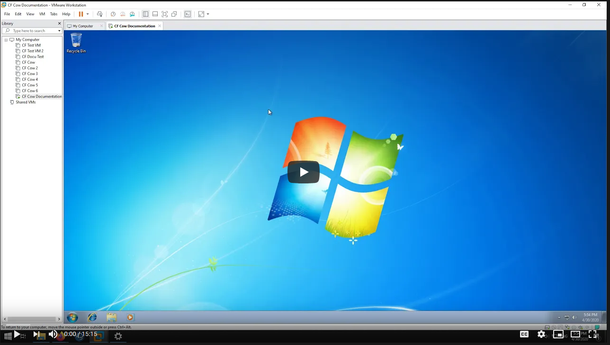

# Video Guides

> Here you can find various video guides for this documentation.  

## VMWare Setup Instructions (Full Guide) [DEPRECATED!]

!!! error "DEPRECATION NOTICE"
    This video guide is outdated and patched. It will **NOT** work in current CrossFire versions (2021 onwards).  
    The video remains here for documentation purposes, an updated guide may follow.

It shows you how to get your Virtual Machine up and running, configure it properly and finally run CrossFire on it.  
The video will guide you through everything you can read in this documentation but might also give you some small tips to improve your workflow.  

## Missing any Videos?

> Please reach out if you want more video instructions on how to get something up and running.
