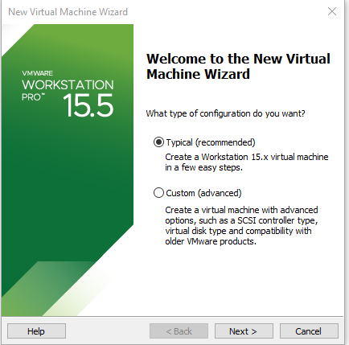
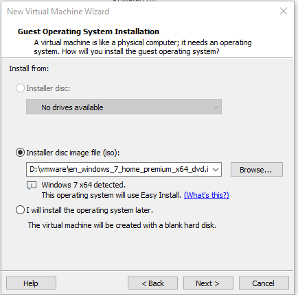
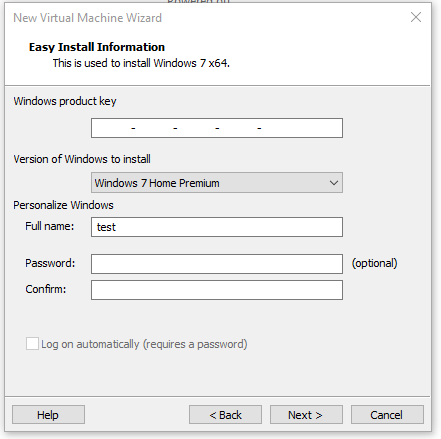
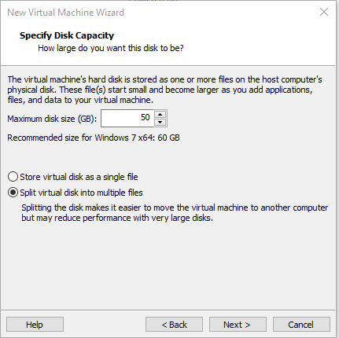
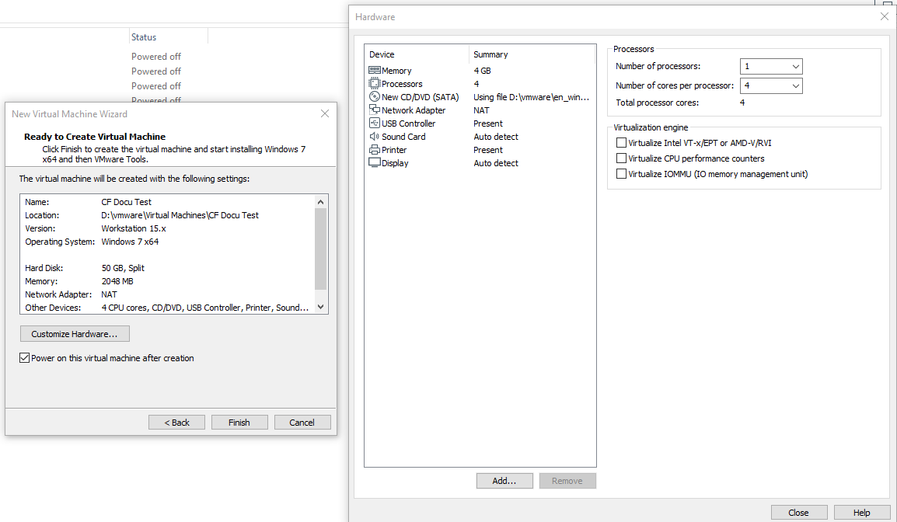

# Instructions - Creating a Virtual Machine

!!! warning "Important: Before you start"
    Make sure you're not installing any VMWare Utility Tools while setting up your virtual machine!

Open VMWare Workstation and Select `File -> New Virtual Machine`.

If you don't want to quickly get started select `Typical`.  
However, if you're into PC/VM configuration you can select `Custom` and adjust the settings of your VM to your needs.  

Browse your Windows 7 ISO. You will see a hint displaying that VMWare is going to use Easy Install to setup this VM.  

Fill out the Easy Install form to fullfill your needs.  
The only thing required by default is a username.  
If you don't enter a license key, Windows is going to run in trial mode.  

Configure the size of the partition you want to give your virtual machine.  
50 GB per VM is recommended.  

!!! tip
    You might want to adjust your disk size depending on the amount of CrossFire versions you want to install on a single Virtual Machine.  
    Each CrossFire Client Takes at least +10GB.

Once you completed these steps, you will see the complete setup in a summary.  
If you want to adjust your Virtual Machine specs you can do this now.  
Below is a sample configuration of mine.  

  

!!! tip
    Consider switching the Network Adapter to use a Bridget connection instead of NAT.  
    This avoids getting `Network Connection Errors` in CrossFire as each client gets its own IP-Address.