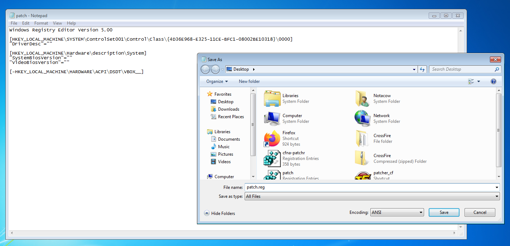

# Patching the registry

## Create/Download Registry Patch

There are two ways you can apply the registry patch. You can either download the already created registry patch file, or create it yourself.  
Below you can follow the instructions for your desired way to do so.

## Download the Registry Patch

Download the [registry-patch-cf-2022.reg](https://github.com/cfna/vmware-docs/blob/master/patches/registry-patch-cf-2022.reg) and save it to your Virtual Machine.
This registry patch contains some required values which need to be changed in order to bypass security checks.  

Once you have the file on your Virtual Machine, simply double-click to execute it.  
You will see an information and get asked if you want to continue, press `Yes` to apply the registry patch.  


!!! tip
    Usually you should be prompted by the Windows System to execute the registry patch as admin.  
    However, if not, try right click and select `Run as Administrator`.  

Once the changes applied successfully you're good to go.  


## Create the Registry Patch manually

On your Virtual Machine, create a new text document and open it in Notepad.  
Paste the following content into the file:

```
Windows Registry Editor Version 5.00
 
[HKEY_LOCAL_MACHINE\SYSTEM\ControlSet001\Control\Class\{4D36E968-E325-11CE-BFC1-08002BE10318}\0000]
"DriverDesc"=""
 
[HKEY_LOCAL_MACHINE\Hardware\description\System]
"SystemBiosVersion"=""
"VideoBiosVersion"=""
 
[-HKEY_LOCAL_MACHINE\HARDWARE\ACPI\DSDT\VBOX__]
```

Now select `File -> Save As` and name your file `registry-patch-cf.reg`.

!!! info
    When saving the file, make sure to select `Save as type:` to use `All Files`.  
    Otherwise you will not be able to execute the registry patch.

  

That's it. Now you can close your editor and search for the `registry-patch-cf.reg` file you just created and double-click to execute it.  
You will see an information and get asked if you want to continue, press `Yes` to apply the registry patch.  


!!! tip
    Usually you should be prompted by the Windows System to execute the registry patch as admin.  
    However, if not, try right click and select `Run as Administrator`.  

Once the changes applied successfully you're good to go.  


