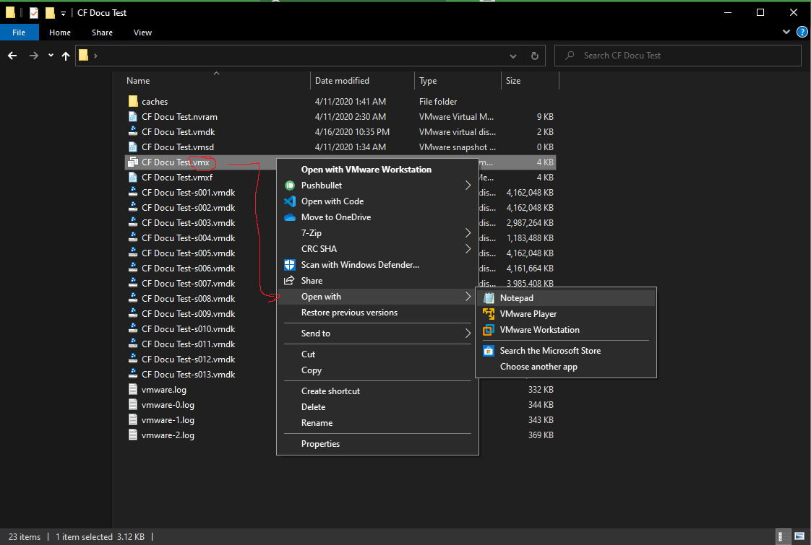

# Updating Virtual Machine Configuration

In order to be able to run CrossFire on the Virtual Machine you just created, you will need to add some additional properties to you VMs configuration file.

If your Virtual Machine is still powered on, make sure to turn it off before editing the config file.

!!! tip
    If you want to copy CrossFire from your Host System make sure to do this before adjusting the configuration.  
    It seems like adjusting the configuration will break drag-and-drop feature.

## Adjust your configuration file

Find your Virtual Machines's Configuration file.  
The config file is located inside the directory you selected when setting up the Virtual Machine and is called `{YourVMName}.vmx`.  



Open the config file with any editor of your choice and append the following lines:

```
hypervisor.cpuid.v0 = "FALSE"
board-id.reflectHost = "TRUE"
hw.model.reflectHost = "TRUE"
serialNumber.reflectHost = "TRUE"
smbios.reflectHost = "TRUE"
SMBIOS.noOEMStrings = "TRUE"
isolation.tools.getPtrLocation.disable = "TRUE"
isolation.tools.setPtrLocation.disable = "TRUE"
isolation.tools.setVersion.disable = "TRUE"
isolation.tools.getVersion.disable = "TRUE"
monitor_control.disable_directexec = "TRUE"
monitor_control.disable_chksimd = "TRUE"
monitor_control.disable_ntreloc = "TRUE"
monitor_control.disable_selfmod = "TRUE"
monitor_control.disable_reloc = "TRUE"
monitor_control.disable_btinout = "TRUE"
monitor_control.disable_btmemspace = "TRUE"
monitor_control.disable_btpriv = "TRUE"
monitor_control.disable_btseg = "TRUE"
monitor_control.restrict_backdoor = "TRUE"
scsi0:0.productID = "Tencent SSD"
scsi0:0.vendorID = "Tencent"
ethernet0.address = "00:11:56:20:D2:E8"
```

!!! info
    Credits and special thanks to [hzqst](https://github.com/hzqst/) for providing the proper configuration properties.

Save the file and close it. You can now power the virtual machine up again.  
