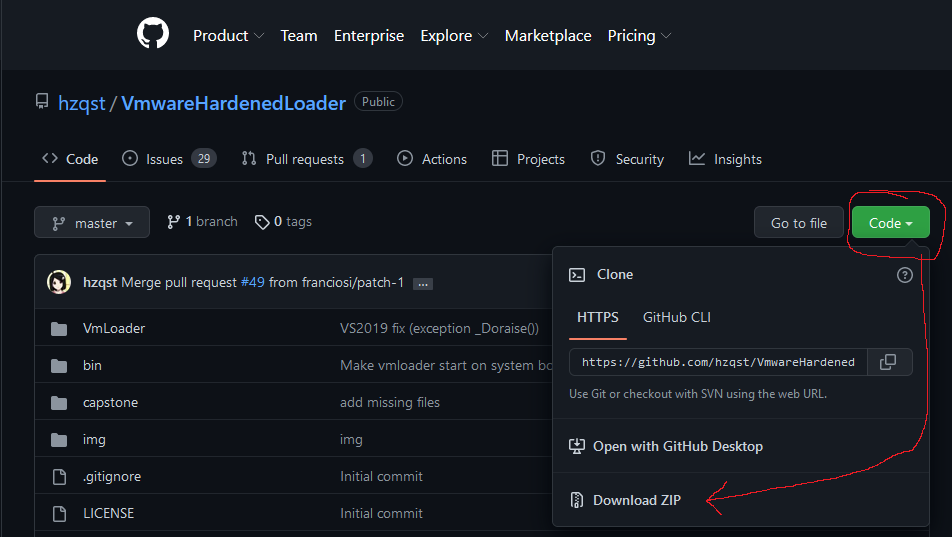
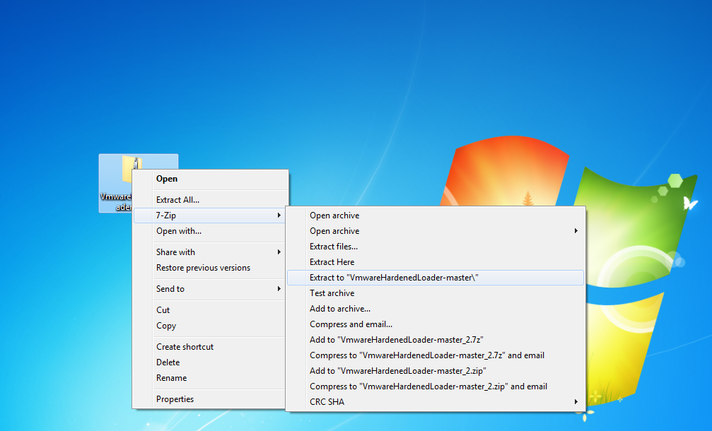
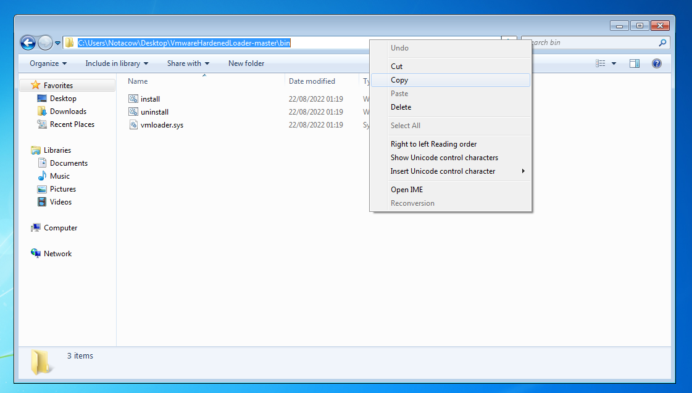
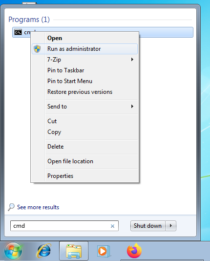
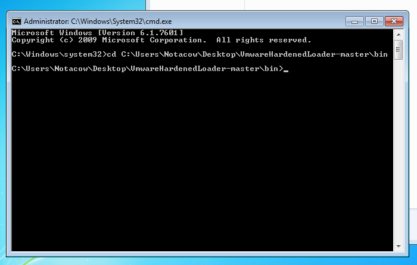
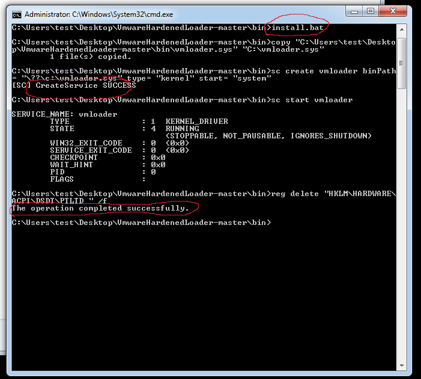

# Setting up VMWare Hardened Loader

!!! info
    This tool is external open source software and is not associated with this guide in any way.  
    However, it's used as essential part of the new VM configuration.  
    **USE AT YOUR OWN RISK!**

In order to bypass CrossFire Virtual Machine validation we're using a tool called [VMWareHardenedLoader](https://github.com/hzqst/VmwareHardenedLoader).

Make sure the VM is powered on, open a browser and [download the tool](https://github.com/hzqst/VmwareHardenedLoader/archive/refs/heads/master.zip) on the Virtual Machine.  

One can either build the binary using the source code (out of scope for this guide) or use the already compiled one provided in the `bin/` folder.  
Once the ZIP File is downloaded use any archiving tool of choice for unzipping (e.g 7zip)  

Open the extracted folder and navigate into the `bin/` directory. Copy the full path of the directory as shown below.  

Once the path is copied go to the start menu and open a `CMD` Window. **Make sure it's executed as Administrator.**

Inside the terminal use `cd ` in combination with the copied path to change the directory.

!!! info
    In case pasting using `Ctrl+V` isn't working try `Right Click into the Window -> Paste`  

Execute the `install.bat`. After the setup completed one should see a success message in the terminal.

The setup is now completed and CrossFire is able to run on the Virtual Machine.
